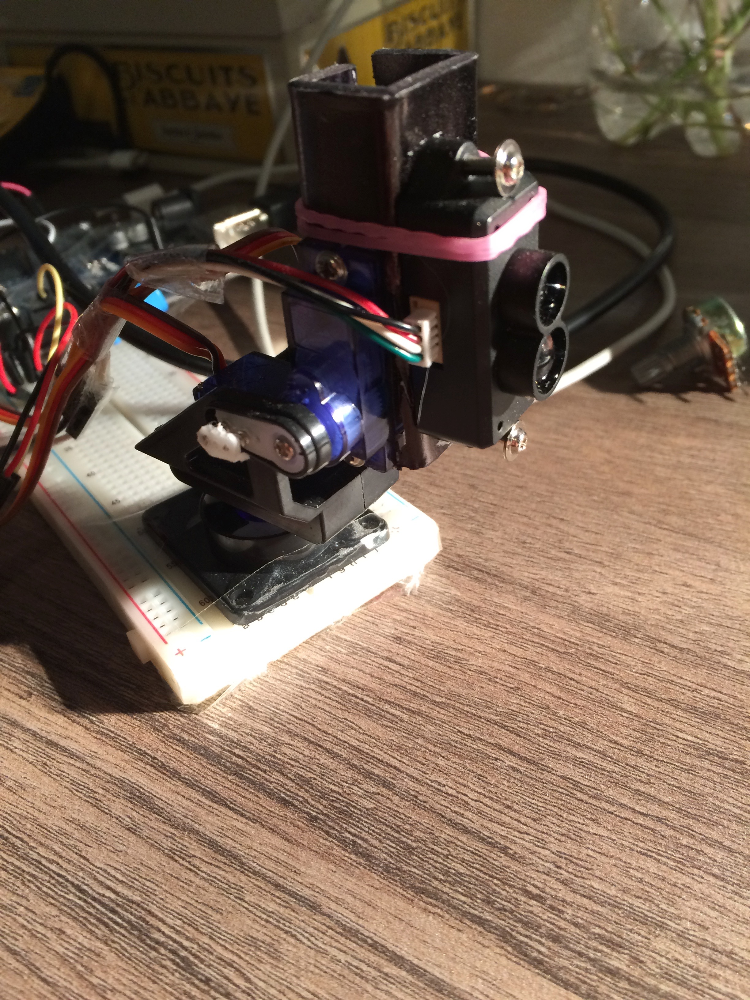
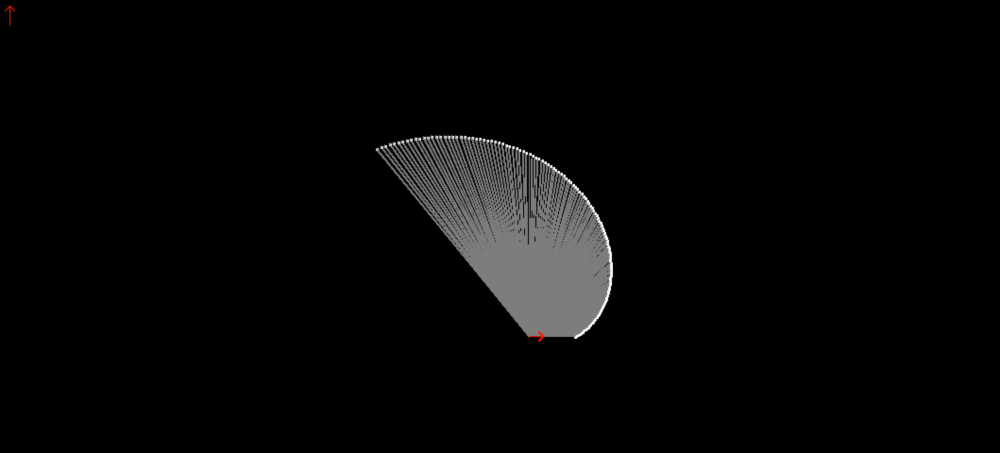

Ce projet est réalisé dans le cadre de la formation de prépa intégrée de Polytech'Nice Sophia
* * *
# Mapping with an Arduino Robot
&nbsp;&nbsp;&nbsp;&nbsp;&nbsp;&nbsp; Projet école de création d'un robot arduino permettant la cartographie d'une salle sans données GPS.

## Présentation
&nbsp;&nbsp;&nbsp;&nbsp;&nbsp;&nbsp; Ce projet à pour but de réaliser une carte (2D) d'une salle à l'aide d'un robot se déplaçant dans cette pièce et réalisant des mesures graçe à un télémètre Laser et sans données GPS. Ce robot sera dans un premier temps dirigé par utilisateur graçe à un ordinateur et une connexion sans fil. Nous utiliserons pour cela le logiciel processing permettant de traiter les données, afficher la carte et interpréter les commandes de l'utilisateur.

   

&nbsp;&nbsp;&nbsp;&nbsp;&nbsp;&nbsp;Le but ultime de ce projet serait que le robot se déplace de manière autonome dans la pièce. Cette technique appelé SLAM (Simultaneous Location and Mapping) est très complexe, et c'est pourquoi nous utiliserions le l'outil ROS (qui est une surcouche de Linux permettant lacréation de logiciel pour la robotique) qui est très utilisé dans le domaine des robots et comporte des bilbliotèque open sources de SLAM. Nous plaçons cette partie de projet dans un second plan, car c'est une partie très informatique (le cours est axé sur la création d'un projet elctronique avec arduino), et ROS est un outils très complexe qui nous ai pour l'instant inconnue.  

# Mise en place du schéma et du materiel

&nbsp;&nbsp;&nbsp;&nbsp;&nbsp;&nbsp; Voici un schéma explicatif du projet une liste du materiel utilisé et une présentation (power point) réalisé devant nos professeurs.

[liste du materiel](/documentation/liste_du_materiel.md)

[Présentation power point du projet](/documentation/Slam_arduino_bot_presentation.pdf)

 
 
 

***

# Etat de l'avancement du projet : début février
&nbsp;&nbsp;&nbsp;&nbsp;&nbsp;&nbsp; Le projet a avancé de façon homogène durant ces plusieurs semaines et voici la version <a href="documentation/Slam_arduino_bot_presentation.pdf">pdf</a> de la présentation faite en classe sur les chemins emprunté pour le projet.
 
- Du côté de la tourelle laser, nous avons monté un télémetre laser sur un servo moteur à ouverture large (cf. fig. 1).

Le télémetre laser permet d'effectuer des mesures précises mais le montage sur le servo moteur est peu précis. La fréquence des mesures est faibles, environ 3Hz. Nous allons donc continuer avec cela pour le moment car le but principal est d'avoir une tourelle qui marche, dans un second temps nous verons des améliorations à apporter.

 

- Du côté du robot nous nous sommes concentrés sur le fonctionnement délicat des roues codeuses (cf. fig. 2).

Ces roues ont été difficiles à appréhender du fait des mauvaises connections avec la partie du contrôleur des roues crantées. 

- Pour finir, le code au niveau de l'ordinateur avance bien. Le traitement des données peut s'effectuer sous plusieures plateformes. Nous avons choisi Processing afin de traiter les données et de les afficher. L'affichage est pratique car Processing permet de programmer facilement une interface graphique simple.

 

***

# Etat de l'avancement du projet : début mars
&nbsp;&nbsp;&nbsp;&nbsp;&nbsp;&nbsp; Durant ces semaines nous avons fait face à plusieurs problèmes.

 

- Du côté du laser, des problèmes sont apparus. En effet le télémetre laser ne réagisais plus et après beaucoup de tentatives de débeugage, nous avons remarqué que sont impédence d'entré été très faible (de l'ordre de l'Ohm alors qu'un laser normal a un impédence de l'ordre du mégaOhm). Le laser a du grillé suite à un mauvais voyage. Pour le remplacer nous avons un autre télémetre laser à notre disposition, mais la fréquence des mesures commence à poser des problèmes.

- Du coté du robot,
Nous avons récupéré des nouveaux encodeurs pour les roues après que les anciens est grillés. Nous avons tout bien recabler les moteurs et réalisé un robot un carton pour réaliser les premiers tests. Il manque une batterie pour pouvoir coder les mouvements du robot et tester les mouvements 

***

# Etat de l'avancement du projet : début avril

- Du côté du laser, nous avons changé de module et nous sommes parti sur un Lidar. En effet, le lidar a beau etre moins précis et avec une distance de mesure moindre, il a une fréquence de mesure rapide (100 Hz). Cette rapidité permet d'avoir un beau nuage de point plus rapidement. De plus avoir beaucoup de point permettra d'avoir une plus grande précision sur un algorithme de SLAM. Voici donc le lidar, monté sur deux servos moteurs : 

- Du coté du robot,
L'assemblage du robot est quasiment fini. Il manque la fixation des equerres sur le support. Il faut aussi que l'on commande de nouvelle roue avec une bonne fixation sur les axes des moteurs.

- Parallèlement à ces deux tâches, nous avons aussi avancé l'interface graphique ainsi que le transfert du flux de données.

 
Le traitement avec un algorithme de SLAM se fera dans un second temps après avoir réalisé les communications RF.

Une présentation a été réalisé le 5 Avril devant nos professeurs pour faire un point sur notre projet. [Celle-ci est visible ici]([Présentation power point du projet](/documentation/Slam_arduino_bot_mi-parcours.pdf))
